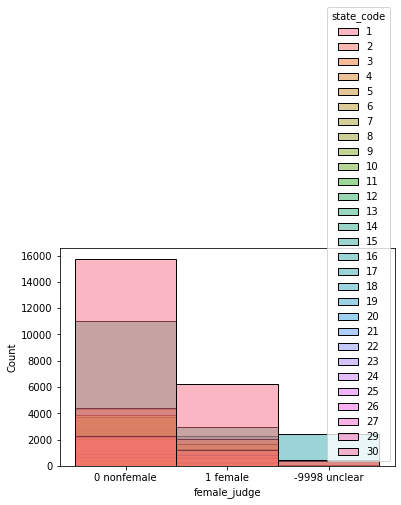

# Project Report
### Analysis of ~80 million Indian district court data across states from the [Development Data Lab](https://www.devdatalab.org/).

The database consists of 3 types of folders
- [Acts Sections metadata](https://docs.google.com/spreadsheets/d/e/2PACX-1vTNxZtceqgzYlUogz-gJfMfqm-RygJZcqfZiFCQAsJYFG7BU1_ZT5aKTPrNODeDgRnoyZFBnjt2sghd/pubhtml)
- [All cases metadata](https://docs.google.com/spreadsheets/u/1/d/e/2PACX-1vSkFghNxGjLxIAsjvUPkW8IV2AF1vf2KOQV93vMhB0TD3CBT13gah1LczI8W0d3Eom1zPcroBuPQ-uy/pubhtml)
- [Judges metadata](https://docs.google.com/spreadsheets/d/e/2PACX-1vSqcp7VlnFB4ujCCHV5uGHjBlwYf7Mo4B3N3aqdiAukS7VMY8lLGU9ejhHH4c8qCse8l1kc8yIkCnq9/pubhtml)

The project was done fully on keggle and the dataset is also uploaded there , refer to the [link](https://www.kaggle.com/code/sarthakbansal007/precog-project/edit)

## Insights on Data

### 1) Dependency of Various Columns of all cases data on duration a case lasted

- Used Mutual Info Regression to calculate MI score of various columns on duration of case
- Disp Name and Type name seemed to have high dependancy on duration .
- It is interesting to note that disp name is outcome of the case , but it still plays a role in predicting duration . Doesn't seem helpful ? Well , if you know a prisoner's trial duration in a court , especially when a prisoner applies for bail in higher courts , you know where to look !!

### 2) Tenure and Number of Judges in Different States

- Data divides states into 4 basic categories
    - T-1 states (pink) => Chandigarh , Telangana , Goa , Delhi
    - T-2 states (brown) => Assam , Bihar , Himachal , Jharkhand
    - T-3 states (orange,red) => Andhra , Karnataka , Kerela 
    - T-4 states(blue) => Chattisgarh , Gujarat , Haryana , Mizoram
 - Less populated states (T-1) tend to have a larger number of judges than fairly high populated states (T-3)
 - Also , T-1 status being well-known to be "urban" or "educated" have larger male-female discrepancy than say , T-2 or T-4 states
 - However , data suggests that judges in T-3 and T-4 states tend to have a longer tenure than judges in T-1 states . Does it indicate "youthfulness" or "Lack of Experience" in T-1 states ??

### 3) Combining All Cases Data and Judges Data to see cases per judge in various states
- I calculated cases/judge = (Total Number of Cases in a state)/(Total Number of Judges in that state)
- States with more cases / judge => Haryana , Karnataka ,Kerala , Chandigarh , Punjab 
- States with less cases / judge => Jharkhand  , Jammu and Kashmir  , Manipur , Mizoram and Sikkim
- It is interesting to note that some states in here like Jharkhand and Jammu and Kashmir are densely populated and are not known to be "clean of crime" per se , but still they have very less cases per judge compared to other states . This makes us think that are all cases getting reported in these states ?? Or are these states really "crime free" contrary to popular opinion ??

## Classifier
### Predicting a Judge's Position Based on "State Code" , "Tenure" and "Start Date"

- Tenserflow environment with keras layers was used in this project
- Categorical Data was **ordinally** encoded and NaN values were filled with mean in data
- Data was split into training (70%) and Validation (30%)
- 3 Dense Layers were used with **softmax activation** in final layer 
- `Loss Function -> sparse_categorical_crossentropy , Optimizer -> adam` and model was run for `10000 epochs`
- **Early stopping callback** was also used to stop training when loss reaches its minimum
- Classifier outputs an array of 565 ( Number of Unique judge positions ) with each entry being the probability that the judge with the feeded input data (Start Date , Tenure and State Code ) holds the outputted position

## How To Run

All the code blocks in the notebook are arranged in correct order of insights and Classifier. Copy the notebook and run the code blocks
